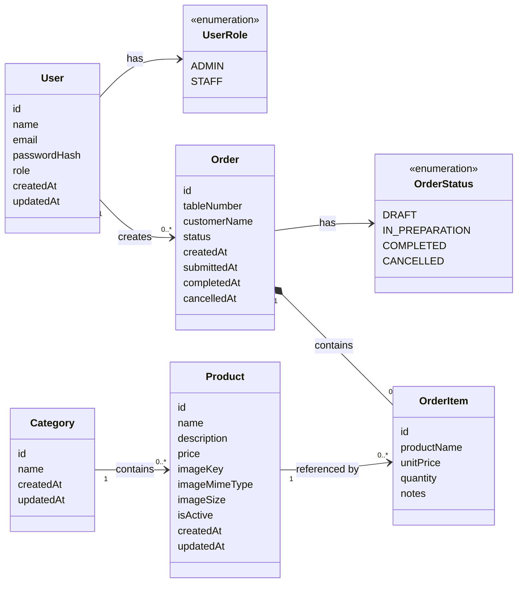

# PizzaHub Domain Model

## 1. Domain Overview

PizzaHub is a backend system for managing a pizzeria's product catalog and order workflow.

The domain is centered on two main areas:

- **Catalog management:** categories and products.
- **Order management:** creation, item management, submission, preparation, completion, and cancellation of orders.

The system supports two user roles:

- **ADMIN:** can perform all operational tasks and manage users, categories, and products.
- **STAFF:** can create, update, submit, complete, and cancel orders.

This document describes the domain concepts and rules independently of frameworks, databases, HTTP routes, or infrastructure technologies.

---

## 2. Domain Entities

### 2.1 User

Represents a person authorized to access PizzaHub.

#### Attributes

- `id`: unique user identifier.
- `name`: user's full name.
- `email`: unique email used for authentication.
- `passwordHash`: securely generated hash of the user's password.
- `role`: user's authorization role.
- `createdAt`: date and time when the user was created.
- `updatedAt`: date and time of the last update.

#### Behaviors

- Update personal information.
- Change role when authorized by an administrator.

#### Invariants

- The name must not be empty.
- The email must be valid and unique.
- The entity stores `passwordHash`, never the plain-text password.
- A plain-text password may exist only temporarily at the registration or authentication boundary.
- The role must be either `ADMIN` or `STAFF`.
- A user cannot assign themselves the `ADMIN` role.
- A user cannot change their own role.

---

### 2.2 Category

Represents a group used to organize products in the pizzeria catalog.

Examples include `Pizzas`, `Drinks`, and `Desserts`.

#### Attributes

- `id`: unique category identifier.
- `name`: unique category name.
- `createdAt`: date and time when the category was created.
- `updatedAt`: date and time of the last update.

#### Behaviors

- Rename the category.

#### Invariants

- The name must not be empty.
- The category name must be unique.
- A category may contain multiple products.
- A category containing products cannot be deleted until its products are removed or reassigned.

---

### 2.3 Product

Represents an item offered by the pizzeria.

#### Attributes

- `id`: unique product identifier.
- `name`: product name.
- `description`: product description.
- `price`: current selling price.
- `imageKey`: storage-neutral reference used to identify the stored product image.
- `imageMimeType`: validated media type of the stored image.
- `imageSize`: size of the stored image in bytes.
- `isActive`: indicates whether the product is currently available.
- `categoryId`: identifier of the category to which the product belongs.
- `createdAt`: date and time when the product was created.
- `updatedAt`: date and time of the last update.

#### Behaviors

- Update product details.
- Change price.
- Change category.
- Activate the product.
- Deactivate the product.

#### Invariants

- The name must not be empty.
- The description must not be empty.
- The price must be greater than zero.
- The product must belong to exactly one category.
- The product image must be represented by a valid `imageKey`.
- The image key must not be an absolute operating-system path or a permanent public URL.
- The image MIME type and size must correspond to the validated uploaded file.
- An inactive product cannot be added to new orders.
- Changing a product's price must not modify existing order items.
- A product may be permanently deleted only when no order item references it.
- A product referenced by an existing order must remain available to historical order records and may only be deactivated.

---

### 2.4 Order

Represents a pizzeria order throughout its lifecycle.

An order is created as a draft, receives items, is submitted for preparation, and may then be completed.
An order may be cancelled while it is in `DRAFT` or `IN_PREPARATION`.

#### Attributes

- `id`: unique order identifier.
- `tableNumber`: required table identification.
- `customerName`: optional customer name.
- `status`: current order status.
- `createdByUserId`: identifier of the user who created the order.
- `items`: collection of order items.
- `createdAt`: date and time when the order was created.
- `submittedAt`: date and time when the order was submitted.
- `completedAt`: date and time when the order was completed.
- `cancelledAt`: date and time when the order was cancelled.

#### Behaviors

- Add a new item.
- Update an item's quantity.
- Update an item's notes.
- Remove an item.
- Submit the order for preparation.
- Complete the order.
- Cancel the order.
- Calculate the total price.

#### Invariants

- Every order must have a creator.
- Every order must have a non-empty `tableNumber`.
- `customerName` is optional.
- A newly created order must start with the `DRAFT` status.
- Only draft orders can have items added, updated, or removed.
- Adding a product always creates a new `OrderItem`; existing items are not merged automatically.
- An order may contain multiple items that reference the same product.
- An order must contain at least one item before being submitted.
- Only draft orders can be submitted for preparation.
- Only orders in preparation can be completed.
- Only orders in `DRAFT` or `IN_PREPARATION` can be cancelled.
- Completed orders cannot be modified or cancelled.
- Cancelled orders cannot be modified, submitted, or completed.
- The order total must be calculated from the historical unit price stored in each order item.

---

### 2.5 OrderItem

Represents a product added to a specific order.

`OrderItem` connects `Order` and `Product`, represents one specific product configuration, and preserves the information required for the order history.

The same product may appear in multiple order items within the same order when
the preparation instructions are different.

#### Attributes

- `id`: unique order item identifier.
- `orderId`: identifier of the related order.
- `productId`: identifier of the referenced product.
- `productName`: product name captured when the item was added.
- `unitPrice`: product price captured when the item was added.
- `quantity`: number of product units that share the same configuration.
- `notes`: optional preparation instructions preserved with the order item.

#### Behaviors

- Change quantity.
- Change preparation notes.
- Calculate subtotal.

#### Invariants

- The quantity must be greater than zero.
- The unit price must be greater than zero.
- Each item must reference exactly one product.
- Each item must belong to exactly one order.
- Multiple items in the same order may reference the same product.
- Each item represents one product configuration.
- All units represented by the item's quantity share the same notes.
- Notes are optional.
- Notes must be trimmed before storage.
- Empty notes must be represented as `null`.
- Notes must not exceed 500 characters.
- The unit price must be captured when the item is added.
- Future product price changes must not affect the item.
- Notes must remain unchanged in historical order records unless the order is still `DRAFT`.
- The subtotal is calculated by multiplying `unitPrice` by `quantity`.

---

## 3. Value Objects

Value objects are domain concepts identified by their values rather than by a unique identity.

They may initially be implemented as primitive values, but their rules belong to the domain.

### 3.1 Email

Represents a valid user email address.

#### Rules

- Must follow a valid email format.
- Must be normalized before comparison.
- Must be unique among users.

---

### 3.2 Money

Represents a monetary value in United States Dollar (`USD`).

#### Attributes

- `amount`: canonical decimal representation of the monetary amount.
- `currency`: fixed system currency, `USD`.

#### Rules

- Product and order-item prices must be greater than zero.
- The system currency is United States Dollar (`USD`).
- Persistence uses a canonical decimal string with exactly two fractional digits.
- Valid persistence examples include `"5.00"`, `"45.90"`, and `"120.00"`.
- Invalid examples include `"45.9"`, `"$45.90"`, `"45,90"`, and negative values.
- The Domain must not use unsafe binary floating-point arithmetic for monetary calculations.
- Infrastructure converts the domain monetary representation to and from the persisted string.

---

### 3.3 Quantity

Represents the number of units of a product in an order.

#### Rules

- Must be an integer.
- Must be greater than zero.

---

## 4. Enumerations

### 4.1 UserRole

Defines the authorization level of a user.

```text
ADMIN
STAFF
```

#### Permissions

| Operation                       | STAFF | ADMIN |
| ------------------------------- | :---: | :---: |
| Create and manage draft orders  |  Yes  |  Yes  |
| Submit orders                   |  Yes  |  Yes  |
| Complete orders                 |  Yes  |  Yes  |
| Cancel draft/preparation orders |  Yes  |  Yes  |
| View categories and products    |  Yes  |  Yes  |
| Manage categories               |  No   |  Yes  |
| Manage products                 |  No   |  Yes  |
| List users                      |  No   |  Yes  |
| Change user roles               |  No   |  Yes  |

`ADMIN` includes all permissions available to `STAFF`.

---

### 4.2 OrderStatus

Defines the current stage of an order.

```text
DRAFT
IN_PREPARATION
COMPLETED
CANCELLED
```

#### Meaning

- `DRAFT`: the order is being assembled and may still be modified.
- `IN_PREPARATION`: the order was submitted and is being prepared.
- `COMPLETED`: the order was successfully prepared and finished.
- `CANCELLED`: the order was cancelled while it was in draft or preparation.

---

## 5. Entity Relationships



### Relationship Summary

- One user can create multiple orders.
- Each order is created by exactly one user.
- One category can contain multiple products.
- Each product belongs to exactly one category.
- One order can contain multiple order items.
- Each order item belongs to exactly one order.
- Each order item references exactly one product.
- One product can appear in multiple order items.

The many-to-many relationship between `Order` and `Product` is resolved by `OrderItem`.

```text
Order → OrderItem → Product
```

---

## 6. Aggregate Boundaries

### 6.1 Order Aggregate

`Order` is the aggregate root for the order workflow.

The `OrderItem` entities belong to the `Order` aggregate and must be changed through the order.

```text
Order
└── OrderItem[]
```

The following operations must be coordinated by `Order`:

- Adding a distinct item.
- Updating an item quantity.
- Updating an item's notes.
- Removing an item.
- Submitting the order.
- Completing the order.
- Cancelling the order.
- Calculating the order total.

An `OrderItem` must not exist independently from an order.

---

### 6.2 Catalog Aggregates

`Category` and `Product` have separate identities and lifecycles.

A product references a category, but the category does not need to control every product operation as part of the same aggregate.

```text
Category ← Product
```

Category deletion rules must verify whether products are still associated with it.

---

### 6.3 User Aggregate

`User` is the aggregate root for user identity and authorization data.

User registration, authentication, and role changes must preserve the user invariants defined in this document.

---

## 7. Order Lifecycle

### Standard Flow

```text
DRAFT → IN_PREPARATION → COMPLETED
```

### Cancellation Flow

```text
DRAFT → CANCELLED
```

```text
DRAFT → IN_PREPARATION → CANCELLED
```

### Allowed Transitions

| Current status   | Operation | Next status      |
| ---------------- | --------- | ---------------- |
| `DRAFT`          | Submit    | `IN_PREPARATION` |
| `DRAFT`          | Cancel    | `CANCELLED`      |
| `IN_PREPARATION` | Cancel    | `CANCELLED`      |
| `IN_PREPARATION` | Complete  | `COMPLETED`      |

### Invalid Transitions

The following examples are not allowed:

```text
DRAFT → COMPLETED
IN_PREPARATION → DRAFT
COMPLETED → DRAFT
CANCELLED → IN_PREPARATION
```

### Allowed Operations by Status

| Operation            | Draft | In preparation | Completed | Cancelled |
| -------------------- | :---: | :------------: | :-------: | :-------: |
| Add item             |  Yes  |       No       |    No     |    No     |
| Update item quantity |  Yes  |       No       |    No     |    No     |
| Remove item          |  Yes  |       No       |    No     |    No     |
| Submit               |  Yes  |       No       |    No     |    No     |
| Complete             |  No   |      Yes       |    No     |    No     |
| Cancel               |  Yes  |      Yes       |    No     |    No     |

---

## 8. Domain Calculations

### 8.1 Order Item Subtotal

```text
subtotal = unitPrice × quantity
```

The calculation uses the historical `unitPrice` stored in the order item.

### 8.2 Order Total

```text
orderTotal = sum of all order item subtotals
```

A product price update must not recalculate the totals of previous orders.

---

## 9. Domain Invariants

The following rules must always be true in a valid PizzaHub domain state:

- Every user has either the `ADMIN` or `STAFF` role.
- Every user has a valid and unique email.
- Users store `passwordHash`, never plain-text passwords.
- Every product belongs to one category.
- Every product price is greater than zero.
- Every order has one creator.
- Every order has a non-empty `tableNumber`.
- `customerName` is optional.
- Every order item belongs to one order.
- Every order item references one product.
- Every order item quantity is greater than zero.
- Multiple order items in one order may reference the same product.
- Every order item represents one product configuration.
- Order-item notes are optional and preserved in order history.
- Every order item stores the product price used at the time it was added.
- Only draft orders can have their items added, updated, or removed.
- A submitted order contains at least one item.
- Only orders in preparation can be completed.
- Completed and cancelled orders are immutable.
- Order totals use historical order item prices.

---

## 10. Domain Policies

Some rules involve more than one entity or aggregate and are treated as domain policies.

### 10.1 Category Deletion Policy

A category cannot be deleted while products still belong to it.

The products must first be:

- removed, when allowed; or
- reassigned to another category.

### 10.2 Product Deletion Policy

A product may be permanently deleted only when it is not referenced by any
`OrderItem`.

Before deleting a product, the application must verify whether order history
exists for that product.

```text
Product without order history
→ permanent deletion is allowed

Product with order history
→ permanent deletion is rejected
```

Deleting a product must not remove or change historical order information.

### 10.3 Product Availability Policy

An administrator may change a product's `isActive` status independently from
permanent deletion.

An inactive product:

- remains stored in the catalog;
- remains visible in historical orders;
- cannot be added to new orders;
- may be activated again later.

Deactivation is the required alternative when a product has order history but
should no longer be offered for sale.

### 10.4 Role Assignment Policy

- Public registration assigns the `STAFF` role.
- Only an administrator can assign or remove the `ADMIN` role.
- An administrator can change only another user's role.
- An administrator cannot change their own role.

### 10.5 Initial Administrator Bootstrap Policy

Public registration always creates a `STAFF` user.

The first `ADMIN` user is created through a controlled bootstrap command rather
than through a public HTTP endpoint.

The bootstrap operation must:

- require an explicit name, email, and password;
- validate the input;
- hash the password before creating the user;
- reject an email that is already registered;
- create the user with the `ADMIN` role;
- avoid hard-coded credentials;
- be safe to execute only when intentionally invoked.

### 10.6 Product Image Reference Policy

A product stores a storage-neutral image reference instead of a public URL or
an absolute local file-system path.

The product image is represented by:

- `imageKey`;
- `imageMimeType`;
- `imageSize`.

The Application layer uses `imageKey` to reference the stored file.

The Presentation layer may convert `imageKey` into an `imageUrl` when returning
an HTTP response.

Changing the storage mechanism must not require changing the Product entity.

### 10.7 Order Item Configuration Policy

An `OrderItem` represents one product configuration inside an order.

The same product may appear in multiple order items:

```text
OrderItem 1
- productId: pizza-calabresa
- quantity: 2
- notes: "Without onions"

OrderItem 2
- productId: pizza-calabresa
- quantity: 1
- notes: "Extra onions"
```

Each request to add a product creates a new order item. The Domain does not
automatically merge items based on `productId` or notes.

The quantity indicates how many units share exactly the same preparation
instructions.

Notes are optional, limited to 500 characters, normalized by trimming
surrounding whitespace, and stored as `null` when empty.

Structured ingredients, additions, removals, and price-changing customizations
remain outside the initial scope.

### 10.8 Historical Price Policy

When a product is added to an order, its current name and price are copied to the order item.

Future changes to the product must not affect existing order history.

---

## 11. Domain Decisions

The following decisions are part of the current PizzaHub model:

1. The system supports only `ADMIN` and `STAFF`.
2. `ADMIN` includes all permissions available to `STAFF`.
3. `STAFF` can manage the complete operational order workflow.
4. Only `ADMIN` can manage users, categories, and products.
5. Orders may be created without items while they are drafts.
6. An order needs at least one item before submission.
7. Orders can only be cancelled while they are in `DRAFT` or `IN_PREPARATION`.
8. Product images are represented internally by `imageKey`, `imageMimeType`, and `imageSize`.
9. Public image URLs are created by the Presentation layer and are not stored as part of the Product domain entity.
10. Product name and price are captured in `OrderItem` to preserve history.
11. Products without order history may be permanently deleted.
12. Products referenced by order history cannot be permanently deleted and must be deactivated when they are no longer available.
13. Product activation and deactivation are independent from permanent deletion.
14. User entities store `passwordHash`, never a plain-text password.
15. The first administrator is created through a controlled bootstrap command.
16. Monetary values use `USD` and are persisted as canonical decimal strings with two fractional digits.
17. `Order` is the aggregate root responsible for controlling its items and status transitions.
18. Every order requires a `tableNumber`.
19. `customerName` is optional.
20. An administrator cannot change their own role.
21. An order may contain multiple order items that reference the same product.
22. Every add-item operation creates a distinct `OrderItem`; items are not merged automatically.
23. Each `OrderItem` represents one product configuration.
24. `OrderItem.notes` is optional and preserved in order history.
25. An item's quantity represents how many units share the same notes.

---

## 12. Out of Scope

The following concepts are not currently part of the PizzaHub domain:

- Online customer accounts.
- Delivery addresses.
- Delivery tracking.
- Online payments.
- Discount coupons.
- Inventory control.
- Product ingredients.
- Multiple pizzeria branches.
- Refunds.
- Reservations.
- Password-change workflow.
- User-account activation and deactivation.
- Administrator-initiated revocation of another user's sessions.
- System-wide administrator logout.

These concepts may be added in future versions if the project scope expands.

If password changes, user deactivation, or administrative session revocation
are implemented later, the affected refresh-token sessions should be revoked.
